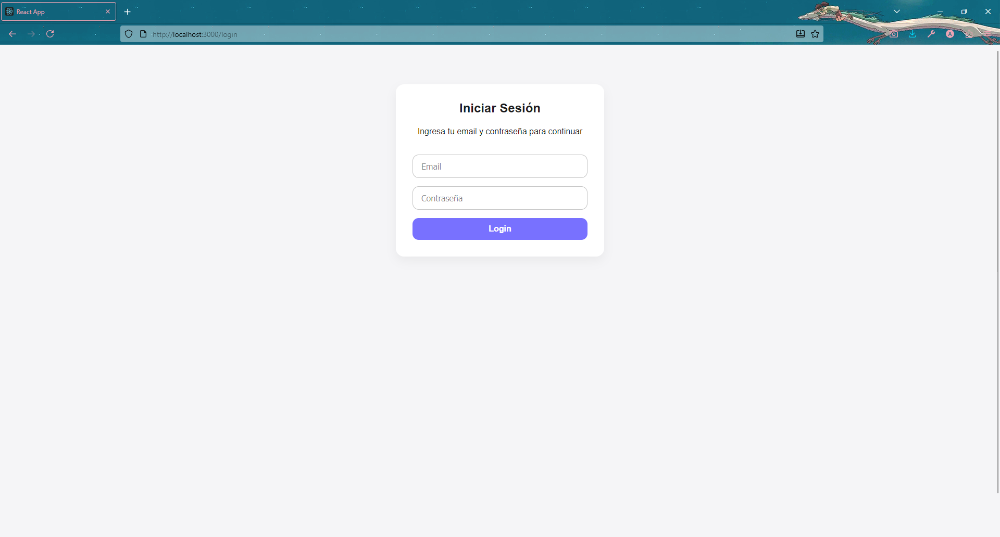

\--- equitylink/README.md ---

# Equity Link - Fullstack App

**Creado por:** Abdiel Ramirez
**Proyecto:** Ejercicio Fullstack – Equity Link

## Esta aplicación consiste en un dashboard con **autenticación**, **roles y permisos**, y manejo de **facturas**.

## Capturas de pantalla

### Login



### Facturas


### Usuarios


## Estructura del proyecto

- `/frontend` → Aplicación ReactJS.
- `/backend` → API Laravel.
- `/docker-compose.yml` → Configuración de MySQL para el backend.

---

## Requisitos

- Node.js ≥ 18
- NPM ≥ 9
- Docker & Docker Compose
- PHP ≥ 8.1
- Composer
- MySQL (opcional si no usas Docker)

---

## Cómo correr la aplicación

### 1. Iniciar el backend (Laravel + MySQL)

```bash
cd backend
docker-compose up -d
composer install
cp .env.example .env
php artisan key:generate
php artisan migrate
php artisan serve
```

- La API estará disponible en `http://localhost:8000`.
- La base de datos MySQL se levanta en el contenedor `equitylink_db`.

### 2. Iniciar el frontend (React)

```bash
cd frontend
npm install
npm start
```

- El frontend estará disponible en `http://localhost:3000`.

- Encuentra instrucciones más detalladas dentro de las carpetas frontend y backend
